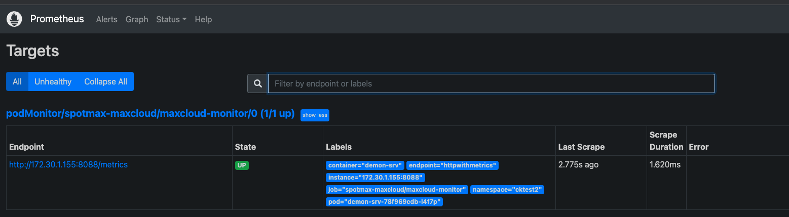
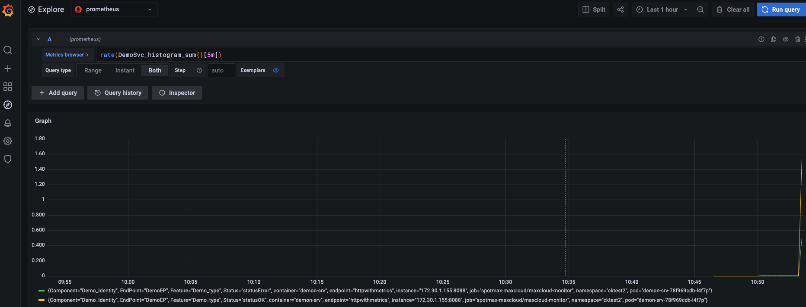

# promk8s
step by step to define your own  metrics and show in prometheus
# Setup

```
git checkout v1.0
go mod tidy
go run main.go
curl http://localhost:8088/hello
curl http://localhost:8088/metrics
```
注册promhttp模块 并添加Hello API （每次调用生成随机数， 如果是双数记OK， 否则记Error）
具体参考 https://blog.csdn.net/ayqy42602/article/details/109066342

# 打包镜像
进行本地验证
```
git checkout v2.0
docker-compose -up 
```
推送到docker registry 备用。 
```
docker build -t chenkui/test:p2.0 ./
docker push chenkui/test:p2.0
```

# 通过maxcloud部署
```
apiVersion: monitoring.coreos.com/v1
kind: PodMonitor
metadata:
  labels:
    release: kube-prometheus-stack
  name: maxcloud-monitor
  namespace: spotmax-maxcloud
spec:
  namespaceSelector:
    matchNames:
      - default
  podMetricsEndpoints:
    - interval: 15s
      path: /metrics
      port: httpwithmetrics
  selector:
    matchLabels:
      maxcloud-prometheus-metrics: enabled
---
apiVersion: apps/v1
kind: Deployment
metadata:
  name: demon-srv
  namespace: default
spec:
  replicas: 1
  selector:
    matchLabels:
      app: demon-srv
  template:
    metadata:
      name: demon-srv
      creationTimestamp: null
      labels:
        app: demon-srv
        maxcloud-prometheus-metrics: enabled
    spec:
      containers:
        - name: demon-srv
          image: chenkui/test:p2.0
          ports:
            - name: httpwithmetrics
              containerPort: 8088
              protocol: TCP
```
这里我们使用PodMonitor， 也可以选择ServiceMonitor
相关文档：
https://cloud.tencent.com/document/product/1416/56001

#检查demo-srv已经被prometheus侦测到

# 在Prometheus中查看自定义Metrics

Metrics name will be 'svc-abc_hitogram-a'
```
promauto.NewHistogramVec(prometheus.HistogramOpts{
		Namespace: "svc-abc",
		Name:      "histogram-a",
		Help:      "histogram with labels Component, Feature, Status",
	}
```
去grafana / prometheus 查看状态


给一些压力， 看看数值变化
```
for i in $(eval echo {1..100}) 
do 
curl  http://localhost:8088/hello 
done

```



#其它

PodMonitor vs ServiceMonitor
https://github.com/prometheus-operator/prometheus-operator/issues/3119

Promhttp
https://pkg.go.dev/github.com/prometheus/client_golang/prometheus/promhttp